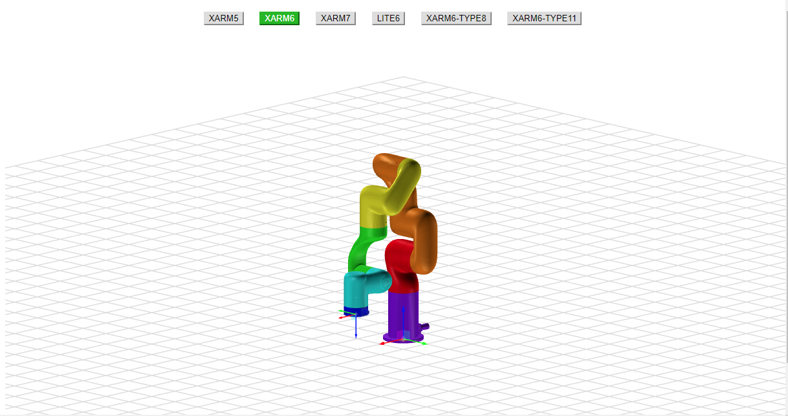
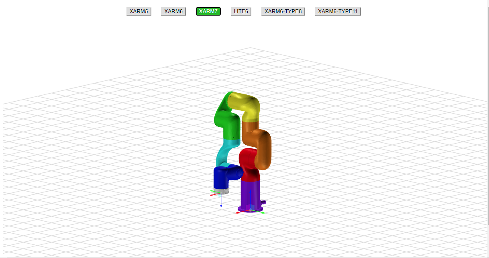
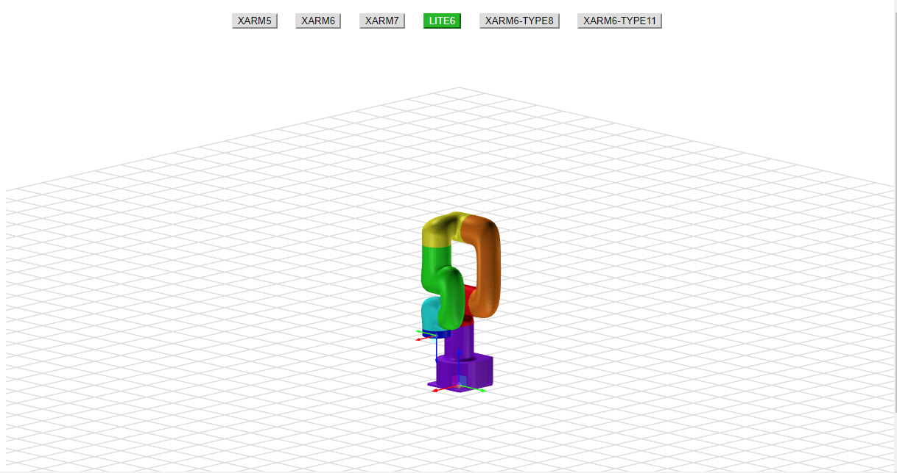
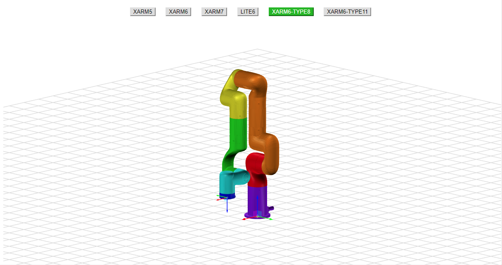
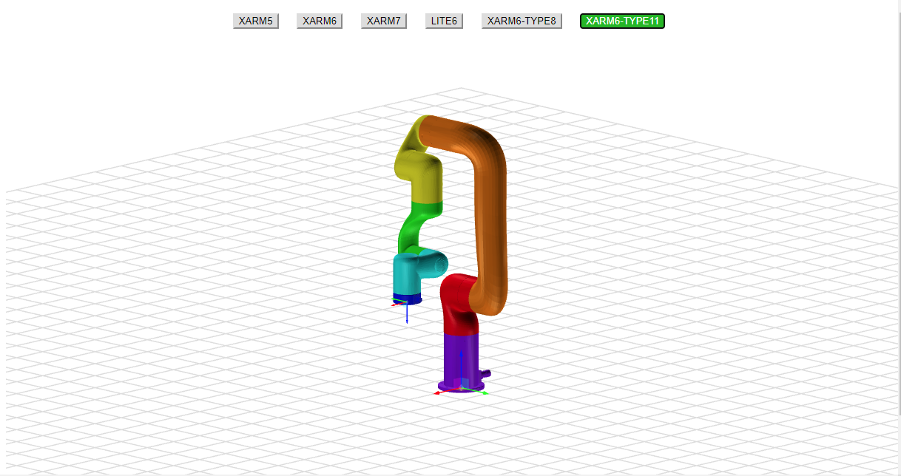

## UFACTORY robot arm model loading library based on three.js

### Run Example
- Load the example through the server (here takes Python as an example)
  ```bash
  # python3
  python3 -m http.server
  # python2
  # python2 -m SimpleHTTPServer

  # Access localhost:8000/ufactory_robot_model_example.html through a browser
  ```
- Introduce in want to enter, refer to [ufactory_robot_model_example.html](./ufactory_robot_model_example.html)

### Example Display
- #### xArm5 (Standard version)
  

- #### xArm6 (Standard version)
  

- #### xArm7 (Standard version)
  

- #### Lite6 (Standard version)
  

- #### xArm6-Type8 (Customized version)
  

- #### xArm6-Type11 (Customized version)
  