## UFACTORY robot arm model loading library based on three.js

### Run Example
- Load the example through the server (here takes Python2/3 and Node as an example)
  - #### Python2
    ```bash
    # run SimpleHTTPServer
    python2 -m SimpleHTTPServer 8888

    # Access http://localhost:8888/ufactory_robot_model_example.html through a browser
    ```
  - #### Python3
    ```bash
    # run http.server
    python3 -m http.server 8888

    # Access http://localhost:8888/ufactory_robot_model_example.html through a browser
    ```
  - #### Node
    ```bash
    # install anywhere
    npm install -g anywhere
    # run anywhere server
    anywhere -h localhost -p 8888 -s

    # Access http://localhost:8888/ufactory_robot_model_example.html through a browser
    ```

- Introduce in want to enter, refer to [ufactory_robot_model_example.html](./ufactory_robot_model_example.html)

### Example Display
- #### xArm5 (Standard version)
  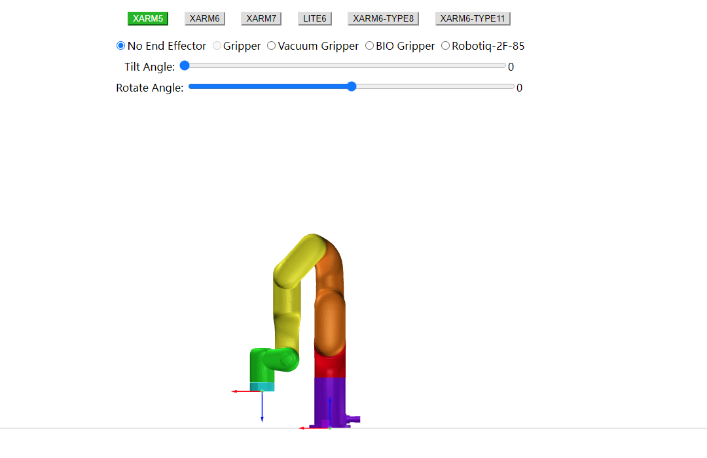
  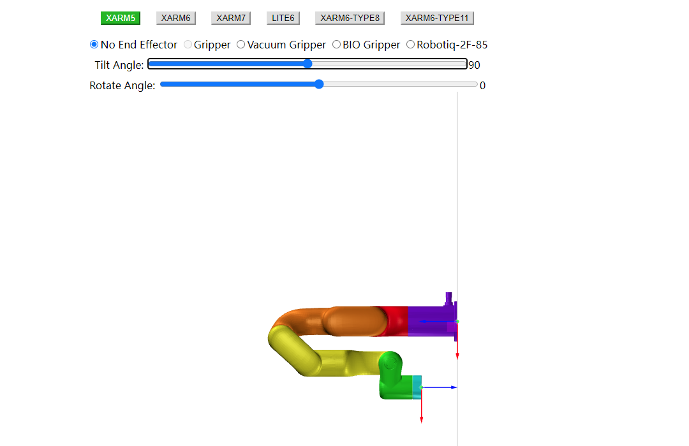
  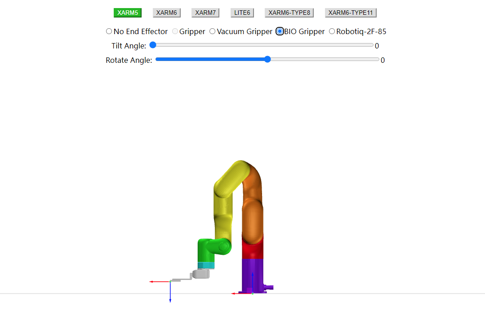

- #### xArm6 (Standard version)
  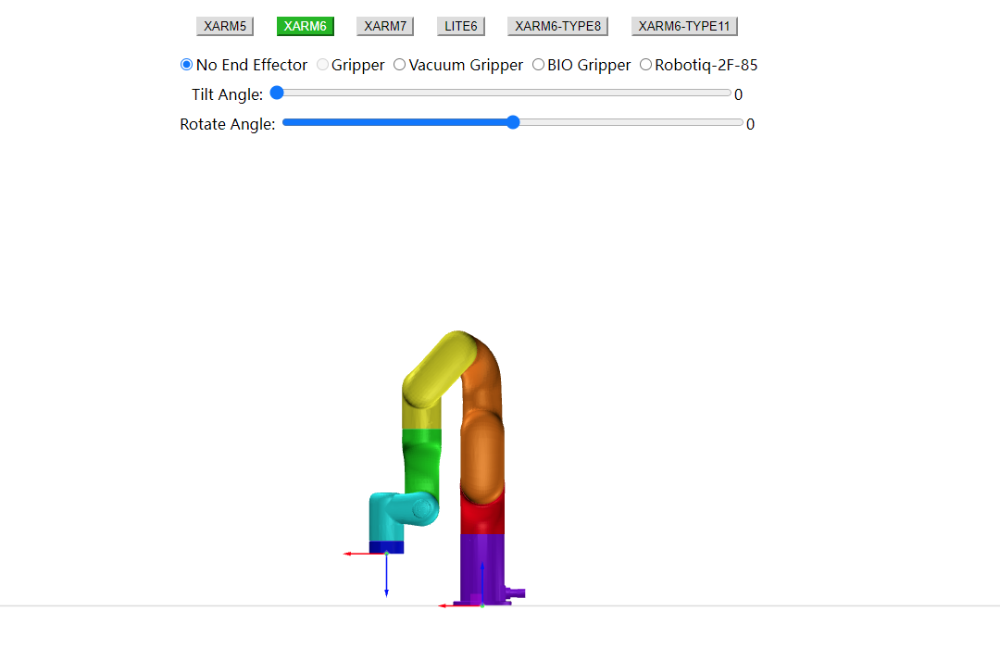
  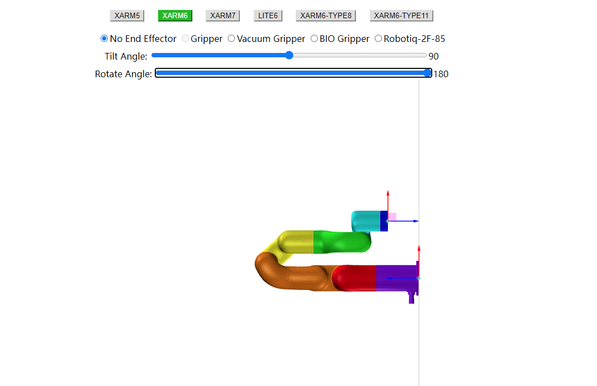
  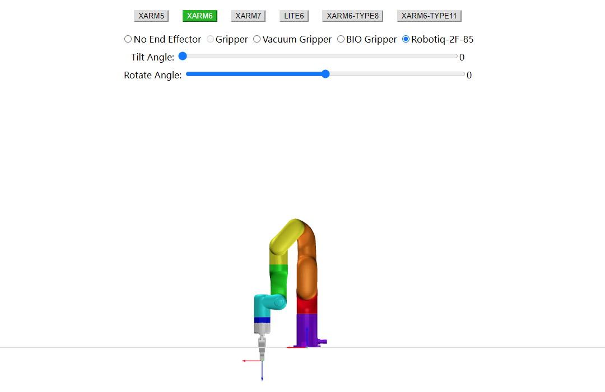

- #### xArm7 (Standard version)
  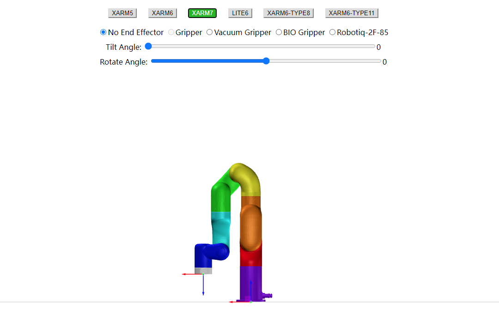
  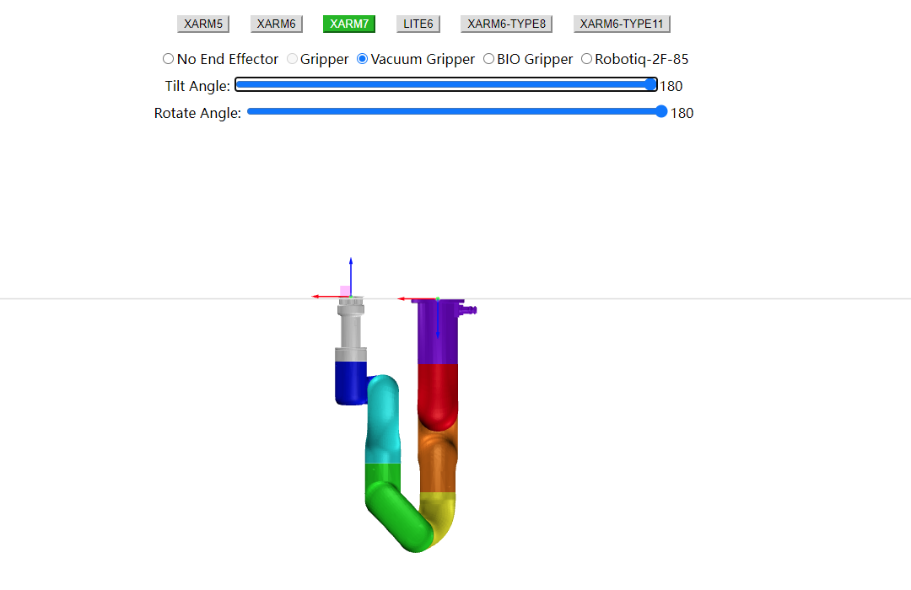

- #### Lite6 (Standard version)
  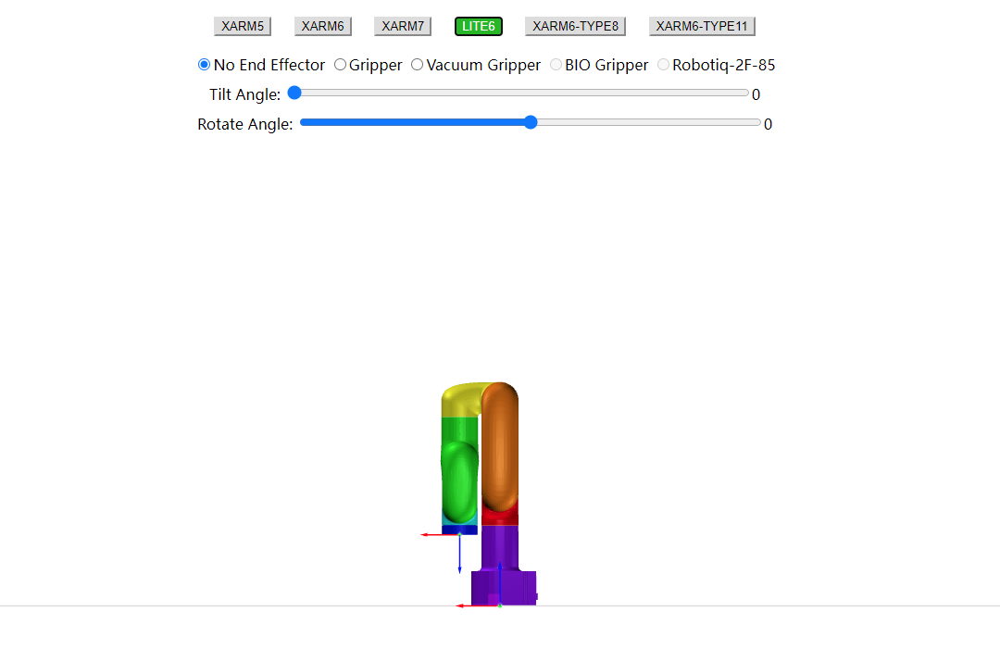
  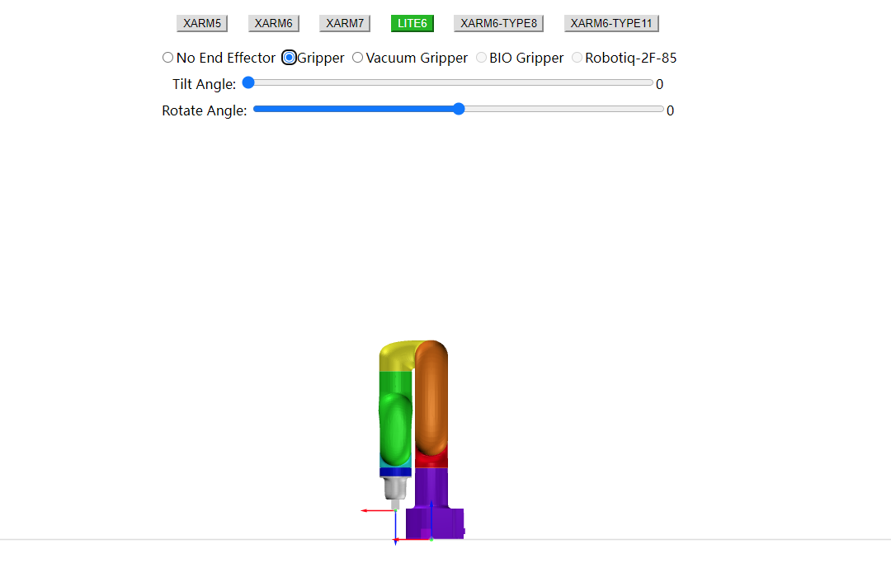
  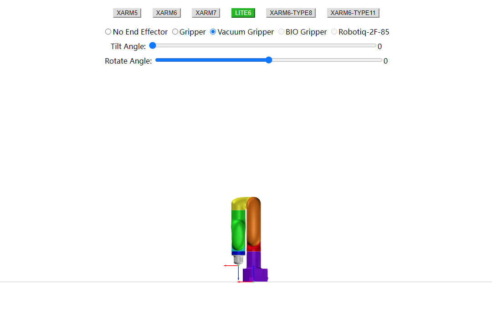

- #### xArm6-Type8 (Customized version)
  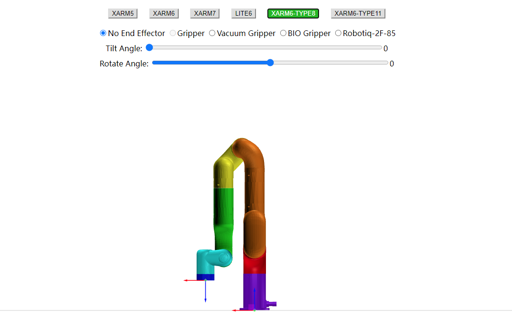

- #### xArm6-Type11 (Customized version)
  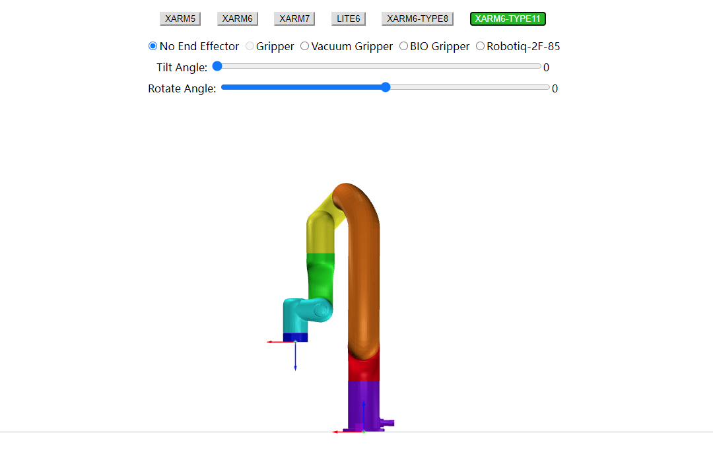